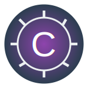

+ 
# Curious
A simple and effective framework for training LLMs using RL and rule-based reward models.

Curious is built to help researchers and developers train large language models with reinforcement learning combined with a simple rule-based reward model. Our aim is to keep the framework clear, efficient, and easy to use. Currently, we support GRPO training on the GSM8K dataset. In the future, we plan to add support for Dr.GRPO, DAPO, MATH AIME, and RAG-RL.

## Table of Contents
- [Introduction](#introduction)
- [Features](#features)
- [Installation](#installation)
- [Usage](#usage)
  - [Training](#training)
  - [Evaluation](#evaluation)
- [Configuration](#configuration)
- [Roadmap](#roadmap)
- [Contributing](#contributing)
- [License](#license)
- [Acknowledgements](#acknowledgements)

## Introduction
Curious is a straightforward framework designed to train LLMs using reinforcement learning and a rule-based reward model. It provides a simple yet powerful training loop based on GRPO and uses the GSM8K dataset for evaluation. The focus is on clarity and efficiency, making it easy for anyone to get started and experiment.

## Features
- **Simple RL-based Training:** A clear and easy-to-follow policy gradient training loop.
- **Configurable Settings:** Adjust parameters using Python data classes and command line options.

## Installation
This project uses [uv](https://docs.astral.sh/uv/) to manage dependencies.

### Steps:
1. **Clone the Repository:**
   ```bash
   git clone https://github.com/RobbenRibery/curious.git
   cd curious
   ```
2. **Install Dependencies:**
   ```bash
   uv sync --group dev
   ```

### H100 VM setup
On an H100 VM, install the prebuilt CUDA 13 PyTorch/SGLang/FlashAttention stack
into uv's default project environment, `.venv`:
```bash
uv -vv sync --group h100-vm
```

The local H100 training launchers check for `flash_attn_3` and
`flash_attn_interface` before starting. Run the sync command again after
changing Python or the virtual environment. Do not remove or recreate `.venv`
unless you intentionally want a clean environment.

## Usage
Curious provides separate scripts for training and evaluation. Both use command line options (via tyro) for easy configuration.

### Training
```bash
uv run python -m curious.training --help
```

### Modal Training
Install and authenticate the Modal CLI:
```bash
uv tool install modal
uv tool run modal setup
```

Launch training from your local checkout onto Modal:
```bash
scripts/launch_baseline_gsm8k_grpo_modal.sh
```

The prepared baseline uses `Qwen/Qwen3-1.7B` with SGLang rollout generation
and FlashAttention-3 on one H100. The Modal launcher persists train logs, eval
logs, checkpoints, Hugging Face cache, and W&B cache in the
`curious-training-artifacts` Modal Volume. The wrapper forwards unknown flags to
`curious.training`; use `--` only when you want to separate launcher options
from training options:
```bash
scripts/modal_train.sh --gpu A100-80GB --timeout 86400 -- \
  --base-config.checkpoint-interval 20
```

Before a training run, you can smoke-test the Liger PyTorch model path with
Transformers FlashAttention-3 on the same Modal H100 image:
```bash
scripts/modal_train.sh --gpu H100 --smoke-fa3
```

You can call Modal directly as well; Modal's own CLI needs the first `--` before app arguments:
```bash
uv tool run modal run -m curious.modal_train -- --gpu H100 -- \
  --wandb-config.project curious
```

Secrets are not committed. The launcher forwards local `.env`, `WANDB_API_KEY`, `HF_TOKEN`, and `HUGGING_FACE_HUB_TOKEN` when present. You can also inject named Modal Secrets:
```bash
uv tool run modal secret create wandb WANDB_API_KEY=...
scripts/modal_train.sh --secret wandb -- --wandb-config.project curious
```

### Evaluation
```bash
uv run python -m curious.evaluate --help
```

## Configuration
Settings are managed using Python data classes (via tyro). You can adjust them in the configuration files or override them via command line options.

## Roadmap
- **Planned:** Add support for Dr.GRPO and DAPO.
- **Planned:** Add support for MATH AIME.
- **Planned:** Extend the framework to include RAG-RL methods.
- **Planned:** Reimplement using JAX! 

## License
This project is licensed under the [MIT License](LICENSE).
